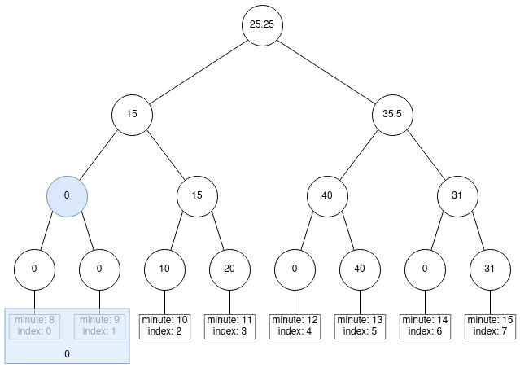
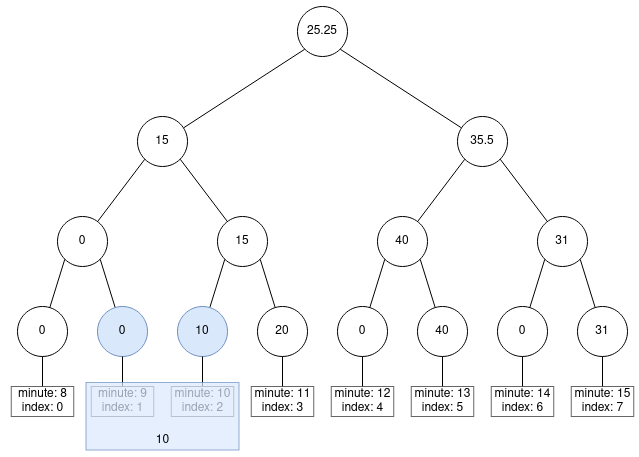
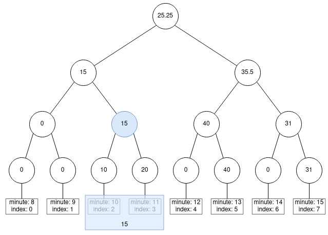
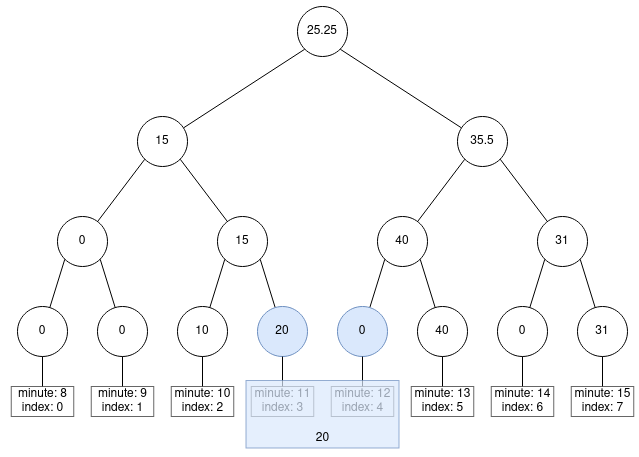
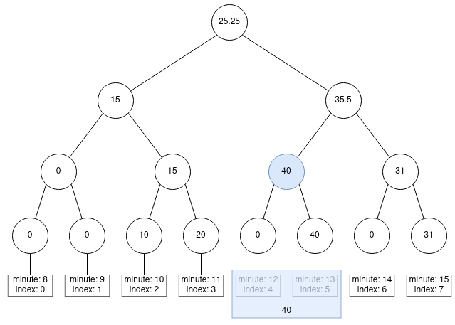
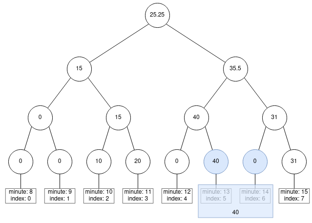
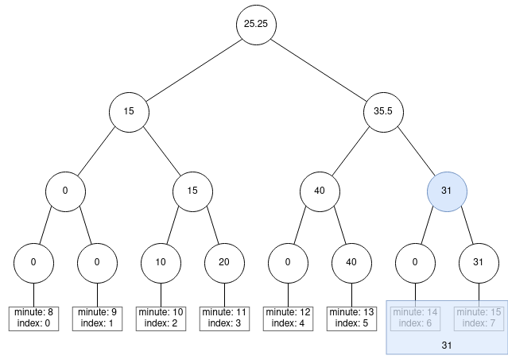

# treebabel 🌲

`treebabel` is a cli application that solves the challenge provided in the `CHALLENGE.md` file using [Segmentation Tree](https://en.wikipedia.org/wiki/Segment_tree).

## Technologies

- Go v1.20
- Docker

## Running the application
<div align="center">
    <a href="https://asciinema.org/a/BWlIWQFHSTixRpYbCVOo2HER0" target="_blank"></a>
</div>

*If you don't have `make` installed in your machine run Docker by your terminal directly:*

```bash
# building docker image
$ docker build -f ./build/package/treebabel/Dockerfile . -t treebabel:latest

# running image and entering in the container
$ docker run -it treebabel:latest bash
```

*Or in case you have just Go installed in your machine, execute the program directly:*

```bash
$ go run ./cmd/treebabel/main.go --input_file ./testdata/treebabel/challenge-input.json --window_size 10
```

## Code Organization
- I am following the [Standard Go Project Layout](https://github.com/golang-standards/project-layout)
- If we have any doubts about how to right our code. We recommend to use the [Uber Style Guide](https://github.com/uber-go/guide)

## What I would like to improve:
- **Message errors**: Sometimes the message error is not so useful. I would like to put more context in the possible errors messages.
- **Debugging logs**: In this application there is no `debug` or `verbose` flag and would be useful if the application have it.
- **Concurrency**: In this application is not using concurrency to improve the processing, we could use that.
- **Graceful Shutdown**: There isn't a graceful shutdown in this application.

# treebabel Algorithm 🌲

In order to calculate the moving average from the input, I am using the [Segmentation Tree](https://en.wikipedia.org/wiki/Segment_tree) algorithm. Below I will explain how I use that to solve the problem:

In order to facilitate our problem, we will use as example the following input:

### **window_size**: 2

### **input_file**:
```json
{"timestamp": "2018-12-26 18:10:40.509645","translation_id": "5aa5b2f39f7254a75aa5","source_language": "en","target_language": "fr","client_name": "airliberty","event_name": "translation_delivered","nr_words": 30, "duration": 10}
{"timestamp": "2018-12-26 18:11:08.509654","translation_id": "5aa5b2f39f7254a75aa5","source_language": "en","target_language": "fr","client_name": "airliberty","event_name": "translation_delivered","nr_words": 30, "duration": 15}
{"timestamp": "2018-12-26 18:11:15.509654","translation_id": "5bb5b2f39f7254a75aa5","source_language": "en","target_language": "fr","client_name": "airliberty","event_name": "translation_delivered","nr_words": 30, "duration": 5}
{"timestamp": "2018-12-26 18:13:19.903159","translation_id": "5aa5b2f39f7254a75aa4","source_language": "en","target_language": "fr","client_name": "airliberty","event_name": "translation_delivered","nr_words": 30, "duration": 40}
{"timestamp": "2018-12-26 18:15:25.961395","translation_id": "5aa5b2f39f7254a75bb3","source_language": "en","target_language": "fr","client_name": "taxi-eats","event_name": "translation_delivered","nr_words": 100, "duration": 31}
```

output:

```bash
root@b9c92981f947:/unbabel-data $ treebabel --input_file ./complex.json --window_size 2
{"date":"2018-12-26 18:10:00","average_delivery_time":0}
{"date":"2018-12-26 18:11:00","average_delivery_time":10}
{"date":"2018-12-26 18:12:00","average_delivery_time":15}
{"date":"2018-12-26 18:13:00","average_delivery_time":20}
{"date":"2018-12-26 18:14:00","average_delivery_time":40}
{"date":"2018-12-26 18:15:00","average_delivery_time":40}
{"date":"2018-12-26 18:16:00","average_delivery_time":31}
```
 
## Solution

1. I split the Segmentation Tree in two: 
    - **Leaves**: Each one means the minutes and stores the sum of `duration` in each minute;
    - **Nodes**: Each one means the average and stores the average between two nodes (son left and son right).

<div align="center">
  
</div>

<br/>

2. You could notice in the image above we are considering the minute 8 and minute 9 too, it is because of the **window size**. The quantity of leaf must be exponencial of 2. It means if you pass a `--window_size 3` the quantity of leaves will use the following logic:

    - What is the range of minute we need to process considering the **window_size 3**?
        - From 7 minutes to 15 minutes
    - What is the range of those minutes?
        - 9
    - is it an exponential of 2 value?
        - **No**, so put the next exponencial of 2: **16** leaves.

<br/>

3. Coming back to our main example, if you wants to print the moving average of each minute, we will use segments of indexes to print it:

#### **minute 10**:
<div align="center">
  
</div>

#### **minute 11**:
<div align="center">
  
</div>

#### **minute 12**:
<div align="center">
  
</div>

#### **minute 13**:
<div align="center">
  
</div>

#### **minute 14**:
<div align="center">
  
</div>

#### **minute 15**:
<div align="center">
  
</div>

#### **minute 16**:
<div align="center">
  
</div>